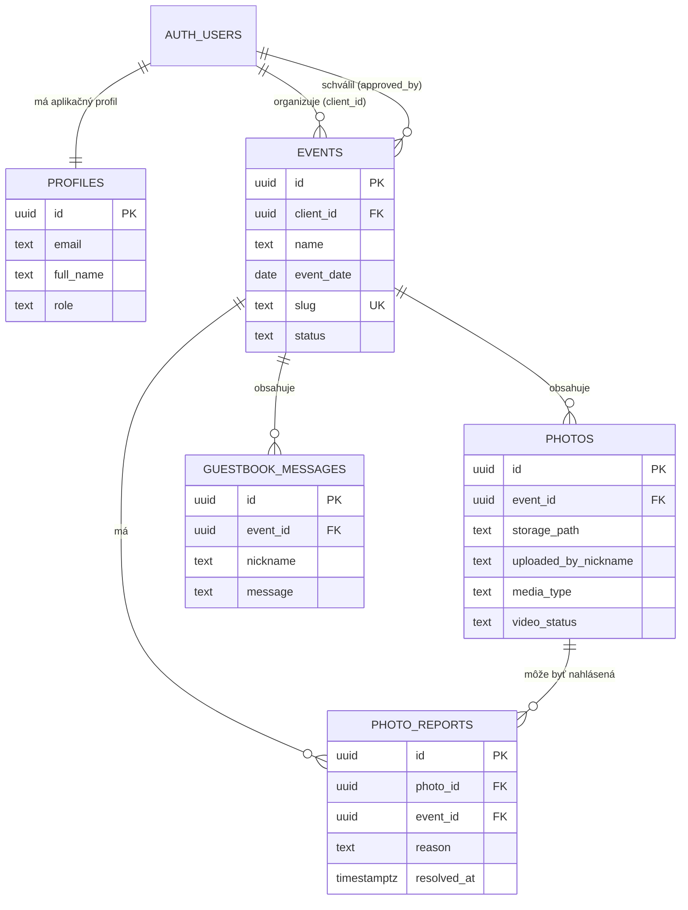

# Databáza NaPamiatku — podklad na obhajobu

Táto schéma opisuje **vlastné tabuľky aplikácie**. Bola porovnaná s produkčnou databázou 6. 10. 2026. Schémy `auth`, `storage`, `realtime` a ďalšie systémové tabuľky vytvára Supabase; pri obhajobe ich netreba vypisovať.

## ER diagram

## Ako diagram čítať

- `auth.users` je systémová tabuľka Supabase: drží prihlasovacie údaje. Aplikácia do nej priamo nepíše.
- `profiles` je vlastná tabuľka pripojená k účtu 1 : 1. Drží meno a rolu `klient` alebo `majitel`.
- `events` je stred aplikácie. Jeden klient môže mať viac akcií; každá akcia má náhodný `slug`, ktorý je vo verejnom odkaze a QR kóde.
- Jedna akcia má ľubovoľný počet `photos` a `guestbook_messages`.
- `photo_reports` spája nahlásenie s konkrétnou fotkou aj akciou. `event_id` je tam zámerne navyše: zjednodušuje zobrazenie nahlásení pre jednu akciu a kontrolu oprávnenia.

V `events` je ešte nullable stĺpec `owner_id` z prvej verzie návrhu. Aktívny vzťah organizátora je dnes `client_id`; `owner_id` sa už v logike aplikácie nepoužíva. Na obhajobe ho môžeš pomenovať ako pozostatok staršieho návrhu, ktorý by sa pri ďalšom refaktoringu odstránil.

## Čo je v jednotlivých tabuľkách

| Tabuľka | Čo predstavuje | Dôležité údaje |
|---|---|---|
| `profiles` | účet organizátora v aplikácii | e-mail, meno, rola |
| `events` | svadba, oslava alebo iné podujatie | názov, dátum, organizátor, stav, zdieľaný odkaz |
| `photos` | jeden záznam v galérii | akcia, cesta k súboru, prezývka hosťa, typ foto/video |
| `guestbook_messages` | jeden odkaz v knihe hostí | akcia, prezývka, text odkazu |
| `photo_reports` | nahlásenie nevhodnej fotky | fotka, akcia, dôvod, stav vybavenia |
| `guest_photo_delete_queue` | krátka technická fronta | cesta súboru, ktorý má server po vymazaní odstrániť z úložiska |

`guest_photo_delete_queue` nie je bežná používateľská entita, preto nie je v hlavnom ER diagrame. Vznikne iba na chvíľu po tom, ako hosť vymaže vlastnú fotku. Server ju spracuje, odstráni fyzický súbor z úložiska a záznam z fronty.

## Prečo fotky nie sú uložené priamo v tabuľke

Do `photos` sa neukladá samotný obrázok ani video, ale iba `storage_path`, napríklad cesta k súboru v buckete `photos`. Veľké binárne súbory rieši Supabase Storage, databáza drží vzťahy a metadáta. Výsledkom sú rýchlejšie dotazy a jednoduchšie zálohovanie dát.

## Bezpečnosť, ktorú vieš vysvetliť

1. **Cudzie kľúče** chránia väzby: fotka nemôže patriť neexistujúcej akcii. Pri vymazaní akcie sa cez `on delete cascade` odstránia aj jej fotky, odkazy a nahlásenia.
2. **RLS pravidlá** obmedzujú priame čítanie tabuliek: klient vidí svoje akcie, majiteľ všetky.
3. **Hostia nemajú účet ani priamy prístup k tabuľkám.** Používajú úzko zamerané databázové funkcie, ktoré dostanú iba náhodný `slug` z QR odkazu.
4. **Vymazanie vlastnej fotky** vyžaduje náhodný kľúč, ktorý si prehliadač hosťa ponechá. Databáza ho pri vymazaní iba porovná a nikdy ho neposiela späť do galérie; samotné ID fotky nestačí.

## Krátka odpoveď pri obhajobe

> Jadro môjho návrhu tvorí tabuľka `events`. Na jednu akciu viažem fotky aj odkazy hostí cez cudzí kľúč `event_id`, takže databáza zachováva referenčnú integritu. Účty rieši Supabase Auth, ale aplikačné roly mám vo vlastnej tabuľke `profiles`. Súbory neukladám priamo do PostgreSQL: v databáze je cesta a metadáta, fyzický súbor je v Storage. Prístup chránim pomocou RLS a hosťom sprístupňujem len bezpečné databázové funkcie, nie celé tabuľky.

## Čo ukázať naživo

V Supabase Studio otvor len schému **`public`** a týchto šesť tabuliek. Neotváraj `auth`, `storage` ani ostatné systémové schémy, pokiaľ sa na ne učiteľ priamo nespýta. Najprv ukáž tento diagram, potom napríklad jednu akciu v `events`, jej fotky vo `photos` a nakoniec väzbu `photos.event_id → events.id`.
